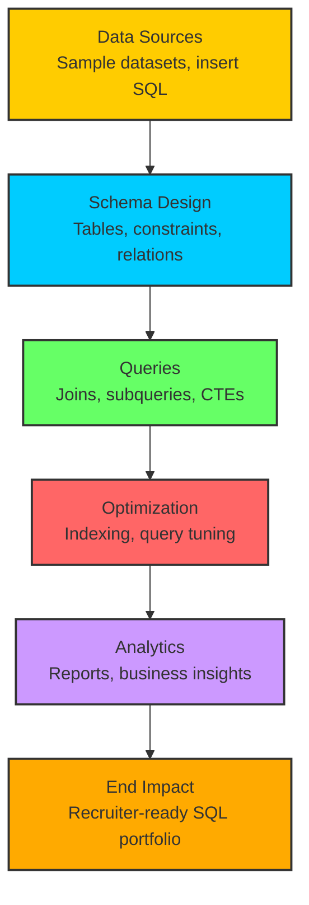

## SQL Scripts Portfolio


This repository contains a curated collection of SQL scripts demonstrating schema design, query optimization, and analytics.  
The examples reflect real-world use cases in healthcare and finance, aligned with my professional experience as a Full Stack Java Developer.

---

## 📖 Overview

This portfolio showcases SQL expertise across schema design, query optimization, and analytics.  
Scripts are organized into modular folders for clarity and practical demonstration.

---

## ⚙️ Features

- **Schema Design** → Normalized tables, constraints, and relationships  
- **Query Optimization** → Indexing, tuning, and performance improvements  
- **Analytics** → Aggregations, reports, and business insights queries  
- **Sample Data** → Insert statements for testing and demos  

---

## 🧪 Tech Stack

- SQL (Oracle, MySQL, PostgreSQL, SQL Server)  
- Schema design and normalization  
- Query optimization and indexing  
- Data analytics and reporting  

---

## 📁 Repository Structure

```text
sql-scripts/
│── README.md
│── schema-design/
│   ├── create_tables.sql
│   ├── constraints.sql
│── queries/
│   ├── joins.sql
│   ├── window_functions.sql
│   ├── ctes.sql
│── optimization/
│   ├── indexing.sql
│   ├── query_tuning.sql
│── analytics/
│   ├── reports.sql
│   ├── business_insights.sql
│── sample-data/
│   ├── insert_patients.sql
│   ├── insert_transactions.sql


## ⚡ Quickstart

Clone the repository:
```bash
git clone https://github.com/aronbariagabr/sql-scripts.git
cd sql-scripts


## 🗂 Architecture Diagram
┌───────────────────────────────┐
│          Data Sources          │
│   Sample datasets, insert SQL  │
└───────────────┬───────────────┘
                │
┌───────────────┴───────────────┐
│        Schema Design           │
│   Tables, constraints, relations│
└───────────────┬───────────────┘
                │
┌───────────────┴───────────────┐
│           Queries              │
│   Joins, subqueries, CTEs      │
└───────────────┬───────────────┘
                │
┌───────────────┴───────────────┐
│        Optimization            │
│   Indexing, query tuning        │
└───────────────┬───────────────┘
                │
┌───────────────┴───────────────┐
│          Analytics             │
│   Reports, business insights   │
└───────────────┬───────────────┘
                │
┌───────────────┴───────────────┐
│          End Impact            │
│   Recruiter-ready SQL portfolio│
└───────────────────────────────┘

## 🔄 Workflow

1. Load Sample Data → Insert test records into tables  
2. Schema Design → Create normalized tables with constraints  
3. Run Queries → Execute joins, subqueries, and CTEs  
4. Optimize → Apply indexing and tuning for performance  
5. Analytics → Generate reports and business insights  

## 🌱 Future Work

- Add advanced query optimization case studies  
- Include healthcare and finance analytics dashboards  
- Provide Dockerized database setup for quick demos

```


## 🗂 Architecture Diagram (Mermaid)

```mermaid
flowchart TD
    A[Step 1] --> B[Step 2]
    B --> C[Step 3]
    C --> D[Step 4]
    D --> E[Step 5]
    E --> F[Step 6]

    %% Define multiple colors
    classDef red fill:#ff6666,stroke:#333,stroke-width:2px;
    classDef blue fill:#66ccff,stroke:#333,stroke-width:2px;
    classDef green fill:#66ff66,stroke:#333,stroke-width:2px;
    classDef purple fill:#cc99ff,stroke:#333,stroke-width:2px;
    classDef orange fill:#ffcc66,stroke:#333,stroke-width:2px;
    classDef teal fill:#33cccc,stroke:#333,stroke-width:2px;

    %% Apply classes
    class A red;
    class B blue;
    class C green;
    class D purple;
    class E orange;
    class F teal;


